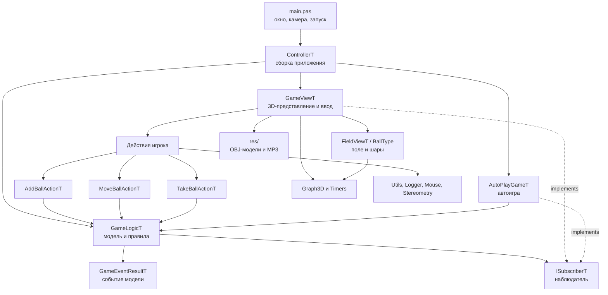

```mermaid
flowchart TB
    Main["main.pas<br/>окно, камера, запуск"]
    Controller["ControllerT<br/>сборка приложения"]
    Logic["GameLogicT<br/>модель и правила"]
    Event["GameEventResultT<br/>событие модели"]
    Subscriber["ISubscriberT<br/>наблюдатель"]

    View["GameViewT<br/>3D-представление и ввод"]
    Field["FieldViewT / BallType<br/>поле и шары"]
    Actions["Действия игрока"]
    Add["AddBallActionT"]
    Move["MoveBallActionT"]
    Take["TakeBallActionT"]

    Auto["AutoPlayGameT<br/>автоигра"]
    Graphics["Graph3D и Timers"]
    Utils["Utils, Logger, Mouse, Stereometry"]
    Assets["res/<br/>OBJ-модели и MP3"]

    Main --> Controller
    Controller --> Logic
    Controller --> View
    Controller --> Auto

    Logic --> Event
    Logic --> Subscriber
    View -. implements .-> Subscriber
    Auto -. implements .-> Subscriber

    View --> Field
    View --> Actions
    Actions --> Add
    Actions --> Move
    Actions --> Take
    Add --> Logic
    Move --> Logic
    Take --> Logic
    Auto --> Logic

    View --> Graphics
    Field --> Graphics
    Actions --> Utils
    View --> Assets
```